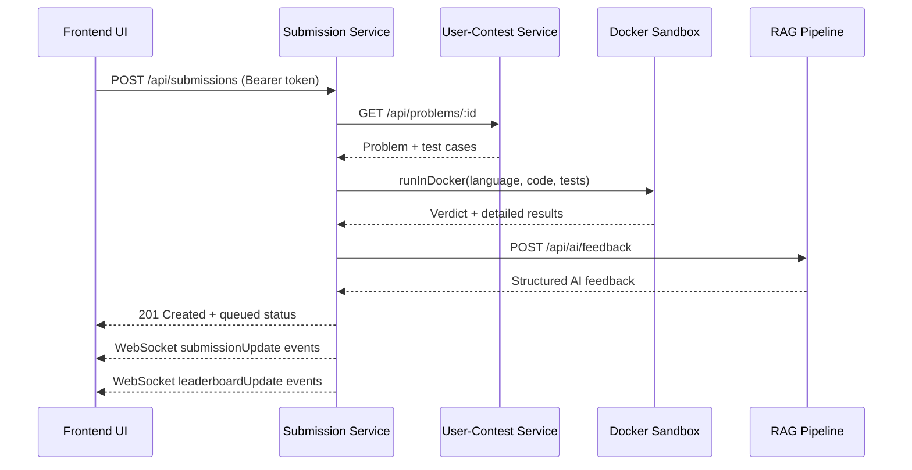
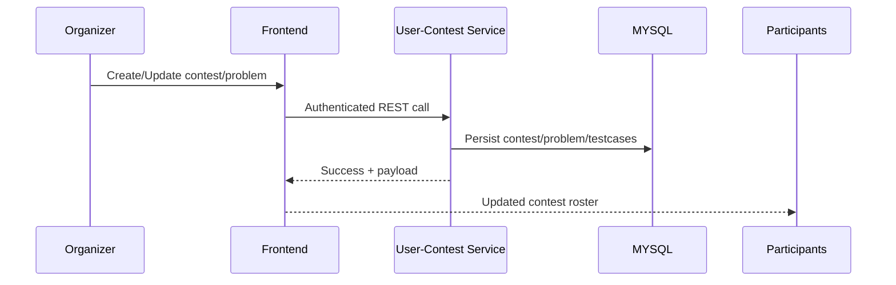

# Quantum Judge Microservices Stack

This repository hosts three collaborating microservices that power the Quantum Judge coding contest platform:

1. **Submission Service** – handles code submissions, runs them inside isolated containers, calculates scores, and broadcasts live updates.
2. **User-Contest Service** – manages authentication, contests, problems, users, and exposes protected REST APIs.
3. **RAG Pipeline Service** – provides AI-generated feedback for submissions via a Retrieval-Augmented Generation (RAG) workflow backed by Gemini embeddings.

All services are container-ready, expose health probes, and communicate over REST/WebSocket APIs while persisting data in MySQL and Chroma vector stores.

---

## Table of Contents
- [Architecture Overview](#architecture-overview)
- [Process Workflows](#process-workflows)
- [Service Responsibilities & Tech Stack](#service-responsibilities--tech-stack)
  - [Submission Service](#submission-service)
  - [User-Contest Service](#user-contest-service)
  - [RAG Pipeline Service](#rag-pipeline-service)
- [Environment Configuration](#environment-configuration)
  - [Submission Service `.env`](#submission-service-env)
  - [User-Contest Service `.env`](#user-contest-service-env)
  - [RAG Pipeline `.env`](#rag-pipeline-env)
- [Local Development](#local-development)
- [Folder Structure](#folder-structure)
- [Diagrams Export Tips](#diagrams-export-tips)

---

## Architecture Overview


```mermaid
graph LR
    FE[Frontend Client (React/Vite)] -- "REST & WebSocket" --> SUB[Submission Service\nPort 5000]
    FE -- "REST" --> UCON[User-Contest Service\nPort 4000]
    SUB -- "Problem metadata" --> UCON
    SUB -- "POST /api/ai/feedback" --> RAG[RAG Pipeline\nPort 8000]
    UCON -- "TypeORM" --> MYSQL[MySQL\nUsers/Contests/Problems]
    SUB -- "TypeORM" --> MYSQL_SUB[MySQL\nSubmissions]
    RAG -- "Chroma" --> VECTOR[Persisted Vector Store]


```

## Process Workflows

### Submission-to-Feedback Flow


### Contest Management Flow


---

## Service Responsibilities & Tech Stack

### Submission Service
- **Primary tasks**
  - Accept authenticated submissions and enqueue code execution.
  - Spin up Docker containers per submission (supports Python, JavaScript, Java, C++).
  - Evaluate against problem test cases fetched from the User-Contest Service.
  - Emit real-time updates via Socket.IO (`submissionUpdate` / `leaderboardUpdate`).
  - Generate AI-driven feedback by calling the RAG Pipeline.
- **Tech stack**: Node.js 18, Express 5, TypeORM, Socket.IO, Axios, Docker-in-Docker (optional), Swagger, Winston logging.
- **Ports**: `5000` (HTTP + WebSocket).
- **Health check**: `GET /health`.

### User-Contest Service
- **Primary tasks**
  - Handle authentication (JWT), authorization, and role-based access control.
  - Manage contests, problems, test cases, registrations, and leaderboard queries.
  - Provide Swagger-documented REST APIs for organizers and contestants.
- **Tech stack**: Node.js 18, Express 5, TypeORM, class-validator, Swagger, Winston logging.
- **Ports**: `4000`.
- **Health check**: `GET /health`.

### RAG Pipeline Service
- **Primary tasks**
  - Serve FastAPI endpoints for AI feedback (`/api/ai/feedback`) and knowledge ingestion (`/api/ai/add_webpage`).
  - Maintain a Chroma vector store seeded with best-practice documents.
  - Use Google Gemini embeddings and generative models to craft feedback.
- **Tech stack**: Python 3.11, FastAPI, LangChain, ChromaDB, Google Generative AI SDK, Uvicorn.
- **Ports**: `8000` (configurable via Uvicorn CLI).
- **Health checks**: `GET /health`, `GET /healthz`.

---

## Environment Configuration
`.env` files are ignored by git (`.gitignore`)—create them locally or in your secret manager before running the services.

### Submission Service `.env`
| Variable | Required | Default | Description |
|----------|----------|---------|-------------|
| `PORT` | ❌ | `5000` | HTTP/WebSocket port.
| `DB_HOST` | ✅ | — | MySQL host for submission metadata.
| `DB_PORT` | ❌ | `3306` | MySQL port.
| `DB_USER` | ✅ | — | MySQL username.
| `DB_PASS` | ✅ | — | MySQL password.
| `DB_NAME` | ✅ | — | MySQL database name.
| `JWT_SECRET` | ✅ | `secret` | Must match the secret used by the auth service.
| `JWT_EXPIRES_IN` | ❌ | `1h` | Token lifetime for new JWTs (if ever issued here).
| `USER_CONTEST_SERVICE_URL` | ❌ | `http://localhost:4000` | Base URL to fetch problems & contests.
| `GENAI_API_URL` | ❌ | `http://localhost:8000/api/ai/feedback` | AI feedback endpoint (RAG service).
| `GENAI_API_KEY` | ❌ | `local-dev-key` | Bearer token forwarded to the RAG service.

**Sample**
```dotenv
PORT=5000
DB_HOST=localhost
DB_PORT=3306
DB_USER=quantum_submission
DB_PASS=super-secret
DB_NAME=submissions_db
JWT_SECRET=replace-with-strong-secret
JWT_EXPIRES_IN=1h
USER_CONTEST_SERVICE_URL=http://localhost:4000
GENAI_API_URL=http://localhost:8000/api/ai/feedback
GENAI_API_KEY=local-dev-key
```

### User-Contest Service `.env`
| Variable | Required | Default | Description |
|----------|----------|---------|-------------|
| `PORT` | ❌ | `4000` | Service port.
| `DB_HOST` | ✅ | — | MySQL host for user/contest data.
| `DB_PORT` | ❌ | `3306` | MySQL port.
| `DB_USER` | ✅ | — | MySQL username.
| `DB_PASS` | ✅ | — | MySQL password.
| `DB_NAME` | ✅ | — | Database name.
| `JWT_SECRET` | ✅ | `secret` | Secret used to sign/authenticate JWTs.
| `JWT_EXPIRES_IN` | ❌ | `1h` | JWT lifetime.
| `ORGANIZER_EMAIL` | ❌ | `admin@gmail.com` | Used by the `seed-problems-rds.js` script.

**Sample**
```dotenv
PORT=4000
DB_HOST=localhost
DB_PORT=3306
DB_USER=quantum_core
DB_PASS=super-secret
DB_NAME=quantum_judge
JWT_SECRET=replace-with-strong-secret
JWT_EXPIRES_IN=1h
ORGANIZER_EMAIL=admin@example.com
```

### RAG Pipeline `.env`
| Variable | Required | Default | Description |
|----------|----------|---------|-------------|
| `GEMINI_API_KEY` | ✅ | — | Google Gemini API key (also exported as `GOOGLE_API_KEY`).
| `VECTORSTORE_DIR` | ❌ | `embeddings` | Directory where Chroma persists vectors.

**Sample**
```dotenv
GEMINI_API_KEY=your-google-gemini-key
VECTORSTORE_DIR=embeddings
```

> **Tip:** The RAG service automatically sets `GOOGLE_API_KEY` from `GEMINI_API_KEY`, so you do not need to duplicate it.

---

## Local Development

### Submission Service
1. `cd submission-service`
2. `npm install`
3. Start dev server: `npm run dev`
4. Production build: `npm run build && npm start`
5. Docker (non-DIND): `docker build -t submission-service .`
6. Docker-in-Docker image (for execution sandbox): `docker build -f Dockerfile.dind -t submission-service-dind .`

> **Note:** Running the sandbox requires Docker socket access or `--privileged` when using the DIND image.

### User-Contest Service
1. `cd user-contest-service`
2. `npm install`
3. Dev server: `npm run dev`
4. Production build: `npm run build && npm start`
5. Docker image: `docker build -t user-contest-service .`

### RAG Pipeline Service
1. `cd Rag-pipeline/rag_service`
2. Create a virtual environment (`python -m venv rag_env`), then `source rag_env/bin/activate` (or `rag_env\Scripts\activate` on Windows).
3. Install deps: `pip install -r requirements.txt`
4. Seed vector store (optional): `python seed.py`
5. Start API: `uvicorn app.main:app --host 0.0.0.0 --port 8000`
6. Docker image: `docker build -t rag-pipeline .`

---

## Folder Structure

### submission-service
```
submission-service/
├── Dockerfile
├── Dockerfile.dind            # Docker-in-Docker base for sandbox runtime
├── package.json
├── tsconfig.json
├── src/
│   ├── app.ts                 # Express app + middleware
│   ├── server.ts              # HTTP + Socket.IO bootstrap
│   ├── controllers/
│   │   └── submission.controller.ts
│   ├── services/
│   │   └── submission.service.ts
│   ├── middleware/
│   │   ├── auth.middleware.ts
│   │   └── requestLogger.ts
│   ├── sandbox/
│   │   └── dockerRunner.ts    # Docker execution queue
│   ├── ai/
│   │   └── feedback.service.ts
│   ├── utils/
│   │   ├── socket.ts
│   │   └── jwt.util.ts
│   └── docs/
│       └── swagger.ts
└── tmp/                       # Runtime scratch space (gitignored)
```

### user-contest-service
```
user-contest-service/
├── Dockerfile
├── package.json
├── tsconfig.json
├── src/
│   ├── app.ts                 # CORS, helmet, request logging
│   ├── server.ts              # DB init + Swagger wiring
│   ├── routes/
│   │   └── problem.routes.ts
│   ├── controllers/
│   │   ├── problem.controller.ts
│   │   └── contest.controller.ts
│   ├── services/
│   │   └── problem.service.ts
│   ├── middleware/
│   │   ├── auth.middleware.ts
│   │   └── role.middleware.ts
│   ├── entities/
│   │   ├── user.entity.ts
│   │   ├── contest.entity.ts
│   │   └── testcase.entity.ts
│   ├── utils/
│   │   ├── jwt.util.ts
│   │   └── logger.ts
│   ├── docs/
│   │   └── swagger.ts
│   └── seed-problems-rds.js   # Seeder for remote RDS instance
└── logs/                      # Winston file transports (gitignored)
```

### Rag-pipeline / rag_service
```
Rag-pipeline/
└── rag_service/
    ├── Dockerfile
    ├── README.md
    ├── requirements.txt
    ├── seed.py                      # Populate Chroma with best-practice PDFs
    ├── app/
    │   ├── main.py                  # FastAPI entrypoint + health checks
    │   ├── rag.py                   # Prompting + embeddings helpers
    │   ├── models.py                # Pydantic models for API payloads
    │   └── utils.py                 # Utility helpers (web scraping, etc.)
    ├── data/                        # Source documents (gitignored if large)
    ├── embeddings/                  # Persisted vectorstore (gitignored)
    └── rag_env/                     # Optional virtualenv (gitignored)
```

---

## Diagrams Export Tips
- The README uses **Mermaid** diagrams. GitHub, GitLab, and VitePress render them natively.
- To export PNG/SVG versions, use the [Mermaid Live Editor](https://mermaid.live/) and paste the snippets from the README.

---

## Maintainers
- **Vishal V D** — [vishalvd006@gmail.com](mailto:vishalvd006@gmail.com)

